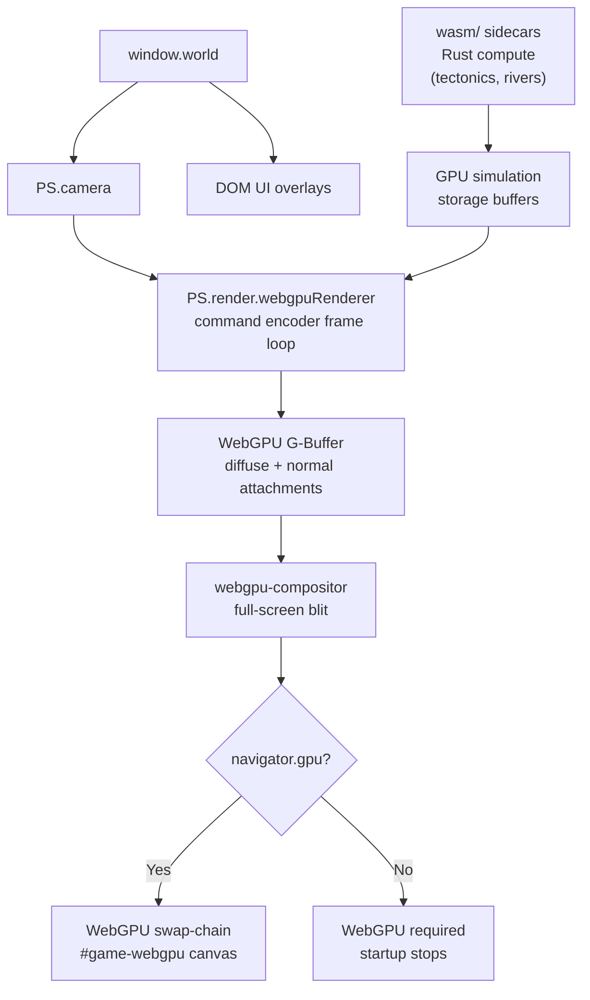

# Pixeldarium Rendering

Date: 2026-06-05 | Updated: 2026-06-08 (WebGPU+WASM migration)

Linear scope: AZR-585 (legacy WebGL2 doc), AZR-843–AZR-851 (WebGPU migration).

## WebGPU Render Pipeline

WebGPU is the required renderer path. WASM handles CPU-heavy simulation compute.
Both are vanilla browser APIs.



Key runtime properties:

- **Compute shaders (WGSL):** Simulation data (heat, LBM ocean, moisture)
  runs as WebGPU compute passes. No ping-pong FBO workarounds.
- **Storage buffers:** Simulation state lives in `GPUBuffer` with read+write
  access in place. No copy-to-texture hack needed.
- **WASM zero-copy bridge:** Rust-computed data (elevation, river networks)
  writes to WASM linear memory; `device.queue.writeBuffer` uploads it directly
  to GPU with no intermediate JS allocation.
- **WGSL shader sidecars:** `.wgsl.js` files set `window.SHADER_*_WGSL`
  globals, loaded via plain `<script src>`.
- **Explicit pipelines:** WebGPU has no global state machine. Each render pass
  uses a declared `GPURenderPipeline` with explicit bind groups.

The draw-order layer table is defined in `js/render/draw-order.js`:

| Order | Layer |
| --- | --- |
| 0 | `TERRAIN_BASE` |
| 1 | `TERRAIN_TRANSITION` |
| 2 | `TERRAIN_DECORATION` |
| 3 | `WATER_SURFACE` |
| 4 | `SHADOW` |
| 5 | `ENTITY_GROUND` |
| 6 | `VEGETATION_TRUNK` |
| 7 | `ENTITY_SORTED` |
| 8 | `VEGETATION_CANOPY` |
| 9 | `BUILDING_WALL` |
| 10 | `BUILDING_ROOF` |
| 11 | `PARTICLE_BELOW` |
| 12 | `WEATHER` |
| 13 | `ROUTE_OVERLAY` |
| 14 | `SELECTION_OVERLAY` |
| 15 | `DEBUG_OVERLAY` |
| 16 | `UI_WORLD` |
| 17 | `UI_SCREEN` |

`ENTITY_SORTED` commands are sorted by `sortY`, `screenY`, or entity `y` before
flush. Other layers flush in numeric order.

## Runtime Stage Responsibilities

Terrain rendering builds chunk addresses from the camera and surface LOD. Ready
chunk payloads provide `cellCache` arrays. `PS.render.surfaceTileBatcher`
converts those cells to atlas instances grouped by atlas page.
`PS.render.webgpuSurfaceTile` uploads those instance buffers and draws each page
with the `terrain-tile.wgsl` WebGPU pipeline.

Surface features are currently represented through terrain material families,
subcell variation, atlas selection, and future layer slots such as
`TERRAIN_DECORATION`, `VEGETATION_TRUNK`, and `VEGETATION_CANOPY`.

Entity sprites are watcher-facing facades for organisms, food, settlements, and
future civilization actors. Entity layers route through the WebGPU entity
renderer and WGSL atlas shaders.

Shadows, particles, routes, selections, debug overlays, and screen UI have
dedicated draw-order slots. Some slots are architecture-ready before every
visual family has a full production renderer.

G-buffer support uses WebGPU targets and WGSL. The shader inventory includes
`gbuffer-terrain.wgsl` and `gbuffer-compose.wgsl` for explicit WebGPU
attachments and compose passes.

DOM UI overlays remain outside the WebGPU draw stack. HUD, panels, menu,
timeline, debug text, and the loading screen are HTML/CSS surfaces layered over
the GPU canvas.

## Coordinate Systems

Pixeldarium uses four active coordinate systems.

World coordinates are planet-relative logical positions. For global and surface
work, this usually means latitude/longitude. `PS.camera.unified.latLonToWorld()`
maps latitude/longitude to `worldX/worldY`; `worldToLatLon()` reverses it.

Tile coordinates are integer grid positions on the current world grid. Tile X
wraps around the planet and tile Y clamps at the poles. `tileToWorld()` and
`worldToTile()` convert between tile and world positions.

Screen coordinates are pixels on `#game-webgpu`. `clientToScreen()` maps DOM
pointer coordinates to canvas pixels. `latLonToScreen()`,
`worldToScreen()`, `screenToLatLon()`, and `screenToWorld()` are the main
camera conversion functions for input and rendering.

UV coordinates are normalized texture coordinates for atlas lookup. Atlas cells
store `u0/v0/u1/v1`. The terrain tile shader mixes `a_uvRect.xy` and
`a_uvRect.zw` from the instance corner; the sprite shader splits an atlas cell
into diffuse and normal/height halves for future lighting.

Surface meters are an intermediate camera representation. `getSurfaceMeters()`,
`surfaceMetersToScreen()`, and `screenToSurfaceMeters()` preserve smooth
Google-Earth-style pan and zoom across latitude-dependent longitude scale.

## Zoom Bands

Configured zoom anchors live in `CONFIG.PLANET_ZOOM_LEVELS`:

| Index | Name | Meters per sample | Chunk size |
| --- | --- | ---: | ---: |
| 0 | Globe | 125000 | 4000 km |
| 1 | Continent | 25000 | 1000 km |
| 2 | Region | 5000 | 200 km |
| 3 | Area | 1000 | 40 km |
| 4 | Landscape | 100 | 4 km |
| 5 | Detail | 25 | 1 km |
| 6 | Ground | 5 | 0.25 km |
| 7 | Meter | 1 | 0.25 km |

`PS.render.pipeline.getZoomBand()` classifies the user-facing bands from the
normalized `PS.render.lod` architecture zoom. The configured camera currently
has eight anchor stops, but those stops cover the full architecture-zoom range
from broad globe view to meter-scale ground inspection.

| Architecture zoom | Band | Perception contract |
| --- | --- | --- |
| `< 3` | orbit | Globe, broad fields, markers, no local detail dependency. |
| `3-5.999` | planet | Surface projection and coarse range understanding. |
| `6-9.999` | continent | Chunked terrain and large material families. |
| `10-14.999` | region | Local surface chunks, territory, pressure, selected detail. |
| `15-18.999` | local | Rich terrain materials and representative entities. |
| `>= 19` | settlement | Building-scale and watcher-facing detail slots. |

`PS.render.lod` maps the same zoom to architecture tiers `galaxy`, `planet`,
`continent`, `region`, and `local` using a normalized 1-20 architecture zoom.
LOD transitions expose blend windows so adjacent tiers can overlap instead of
popping.

## Atlas System

`PS.atlas` is the current runtime atlas. It uses a 256x256 RGBA page with
16-pixel default cells and explicit cell records:

```text
name, pageIndex, x, y, w, h, u0, v0, u1, v1
```

Organism trait cells are allocated as 32x16 records: the left half is diffuse
color and the right half stores normal/height placeholder data. The atlas can
allocate additional 256x256 RGBA pages when authored terrain/entity cells exceed
the current page capacity; renderers already batch by page index.
Organism atlas identity is generated from bounded watcher-facing trait buckets:
lineage `0..15`, body size `1..6`, body shape `0..7`, limb count `0..12`,
appendage type `0..7`, camouflage `0..4`, thermal tolerance `0..4`, water
dependency `0..4`, and animation/RANMAP variant `0..3`. These keys cache
procedural pixel sprites before renderer consumption, so traits change
visible morphology without per-frame sprite generation.
Terrain, surface-color, and atlas terrain base colors consume the `terrain`
palette from `PS.assets` before generating packed color LUTs or atlas pixels.
Palette registration increments a version counter so the cached packed biome and
surface-color tables refresh when a reviewed art pass changes palette values.
Terrain material cells are selected from tile and biome data, cached on ready chunk
cells as `terrainAtlasCell`, and reused until the chunk or registry changes.
Registered terrain material families include bounded IDs for shallow rivers,
tidal mud, lava flows, lichen tundra, and reed mats. These families are
selected from sample material signals such as flow, wet shore, lava/heat,
lichen, and reed density before the cell receives feature, biology/resource,
ecology, or civilization suffixes.
Terrain cells also encode a bounded feature-mark key before biology/resource
suffixes: `feature0` or `feature.<type>.<bucket>`. Feature types currently
cover foam, canopy, ridge, dry scrub, frost, ember, reed, and field marks;
buckets are `1..3`. These marks add close-band terrain identity inside the same
16x16 atlas cell and do not add a draw-call family.
Settlement and route aggregate pressure can also become terrain cell identity:
`civ0` or `civ.<settlement|route|border>.<bucket>.<family>`, with buckets
`1..3`. Bounded families are `farm`, `yard`, `block`, `dock`, and
`production` for settlements; `track`, `road`, `canal`, and `dock` for routes;
and `border` for border influence. The civilization key is derived from the
ready surface sample plus current settlement/route aggregate state, then cached
with the terrain atlas cell so WebGPU terrain batches can show footprints,
fields, roadbeds, canals, docks, production blocks, and borders without adding
an entity draw path.
Food/resource entity cells use bounded atlas identities:
`entity.food.<variant>.<richness>.<family>`. Richness is bucketed `0..3`;
family is bucketed `0..3` for living pods, storage/grain, produce/fungus, and
raw material piles. Explicit resource fields win when available; otherwise the
runtime uses deterministic coordinate-derived family selection so ordinary food
nodes do not collapse to one visual language.

Accepted equivalence sheets from `assets/pixeldarium-equivalence/` can override
bounded settlement, vegetation, citizen, stockpile, work-status, material/effect,
and world-UI facade cells. The runtime still loads the reviewed PNG and sprite
metadata, but WebGPU uses the matching `.rgba.json` sidecar as a file-safe texture
source because direct `file://` image pixels are not a reliable upload source.
The decoded RGBA sidecar becomes an atlas page only after the sheet image,
metadata, and pixel data are loaded. If a declared sidecar is corrupt or
incomplete, the accepted sheet is not promoted for rendering.

`PS.render.surfaceTileBatcher` groups terrain instances by atlas page. Ready
chunk cells are appended into pooled growable `Float32Array` page buffers, then
finalized into typed upload ranges before WebGPU submission. Each terrain
instance currently packs 10 floats:

```text
screenX, screenY, width, height, u0, v0, u1, v1, alpha, variation
```

`variation` keeps the existing horizontal-flip bit and packs a bounded RANMAP
shade bucket into the fractional portion. The terrain shaders use it to flip
and subtly brighten/darken repeated material cells without changing the chunk
grid or adding a draw-call family.

The configured terrain upload target is 8192 instances per upload segment in
`PS.render.webgpuSurfaceTile.maxInstances`. Larger visible batches are split
into multiple page draws.

`PS.spriteBatch` supports up to 16384 sprite instances. Each sprite instance
packs 12 floats:

```text
worldX, worldY, u0, v0, u1, v1, tintR, tintG, tintB, tintA, scale, flipH
```

This is not the final AZR-383-style single data-texture tilemap. The current
terrain path is a WebGPU instanced atlas renderer while the data-texture shader
work is prepared.

Settlement readiness facades are pre-settlement watcher markers. They are
derived from aggregate lineage active/peak population progress, capped by
`CONFIG.PLANET_SETTLEMENT_READINESS_MAX_MARKERS`, and stop once authoritative
settlement aggregates exist. Readiness atlas cells own their authored color and
use neutral sprite tint, so the entity shader does not multiply lineage color
twice. They do not create or persist settlements.

## Shader Reference

WGSL shader sources are loaded from `shaders/` by `PS.render.wgslShaders`.
`file://` support is preserved by `.wgsl.js` sidecars when direct text fetch is
not available. Required WGSL shader failures stop startup.

Runtime-owned JSON metadata that is loaded from `assets/manifest.json` must also
ship a `.json.js` sidecar through `PS.assets.registerJSON(...)`. This preserves
the direct static `index.html` runtime when browser fetch cannot read local JSON
files under `file://`.

| Shader | Files | Purpose |
| --- | --- | --- |
| `terrain-tile` | `terrain-tile.wgsl` | Instanced terrain atlas quads from ready surface cells. |
| `terrain` | `terrain.wgsl` | Terrain material shader inventory for the WebGPU terrain stack. |
| `gbuffer-terrain` | `gbuffer-terrain.wgsl` | Writes material albedo and normal/height data into local G-buffer attachments. |
| `globe-sphere` | `globe-sphere.wgsl` | Samples terrain and overlay textures onto an interactive globe projection. |
| `surface-underlay` | `surface-underlay.wgsl` | Full-screen aggregate terrain underlay for filled local/region zoom while detailed chunks stream. |
| `surface-chunk` | `surface-chunk.wgsl` | Surface chunk shader slot for chunk rendering experiments. |
| `heat-diffusion` | `heat-diffusion.wgsl` | WebGPU compute pass for thermal diffusion. |

Shader compile/load failures are loud. Missing required WGSL records
`wgsl.manifest.failed` and stops startup.

## Performance Budget

The target frame budget is 16ms. AZR-586 uses this practical split:

| Work | Target |
| --- | ---: |
| Simulation update | 4 ms |
| Terrain render and upload | 4 ms |
| Entity, particle, and overlay render | 4 ms |
| Compose, UI cadence, and overhead | 4 ms |

Relevant current limits:

- Surface streaming frame budget: `CONFIG.PLANET_SURFACE_STREAMING_FRAME_BUDGET_MS = 4`.
- Particle render budget: `CONFIG.PARTICLE_RENDER_BUDGET_MS = 2`.
- Simulation catch-up cap: `CONFIG.MAX_SIM_UPDATES_PER_FRAME = 3`.
- Frame budget history: `CONFIG.FRAME_BUDGET_HISTORY_LIMIT = 120`.
- Close-band ready surface chunks:
  `CONFIG.PLANET_SURFACE_CLOSE_VISIBLE_CHUNK_LIMIT = 192`.
- Terrain instance upload target: `PS.render.webgpuSurfaceTile.maxInstances = 8192`.
- Terrain RANMAP variation stays inside the existing 10-float instance encoding:
  integer `0|1` for horizontal flip plus a fractional shade bucket in `0..0.24`.
- Ready surface chunk edge feathering stays inside the existing terrain
  instance alpha float. It is bounded by
  `PLANET_SURFACE_READY_EDGE_FEATHER_INNER_RATIO`,
  `PLANET_SURFACE_READY_EDGE_FEATHER_OUTER_RATIO`, and
  `PLANET_SURFACE_READY_EDGE_FEATHER_MIN_ALPHA`.
- Authored material families added for AZR-365 are finite registered tile IDs:
  `river_shallow`, `tidal_mud`, `lava_flow`, `lichen_tundra`, and `reed_mat`.
  They still use the existing 16x16 terrain atlas cell, feature key, and
  chunk/page WebGPU batching path.
- Local ecology terrain encoding: enabled with
  `CONFIG.PLANET_SURFACE_ECOLOGY_ENABLED`, starts at
  `CONFIG.PLANET_SURFACE_ECOLOGY_MIN_ZOOM = 4`, and samples a bounded
  `CONFIG.PLANET_SURFACE_ECOLOGY_RADIUS_TILES = 16`.
- Active ecology microstructure: generated inside the existing 16x16 terrain
  atlas cell after organic/nutrient pressure is known. It adds no new draw-call
  family and uses only the existing food/organism pressure buckets plus a
  bounded `ecoform.0..3` sub-tile phase.
- Entity instance WebGPU limits are pending AZR-847.
- Orbit event markers: `CONFIG.PLANET_ORBIT_EVENT_MARKER_MAX_MARKERS = 24`.
- Watched representative intent markers: `CONFIG.PLANET_REPRESENTATIVE_INTENT_MAX_MARKERS = 128`.
- Active particle cap: `CONFIG.PARTICLE_MAX_ACTIVE = 10000`.

Renderer stats are available through `PS.render.renderer.getStats()`. Key fields
include `drawCalls`, `tilemapDraws`, `tilemapWebgpuDraws`, `tilemapMisses`,
`terrainDraws`, `terrainPageDraws`, `terrainLastFrameMs`, `globeDraws`,
`globeLastFrameMs`, `webgpuContextActive`, `webgpuClearSubmitted`,
`rendererGpuFrameMs`, `overBudget`, `singleVisibleCanvas`, and
`directSingleCanvas`.
Frame budget stats are available through
`PS.debug.performance.getFrameStats()`, including sim, render, overhead, total,
over-budget, and dropped catch-up frame counts.

## Readiness And LOD Contract

Rendering consumes ready data. Surface chunks must be completed and carry a
ready `cellCache` before `webgpuSurfaceTile` draws them. Pending chunks stay in
the worker/cache lifecycle and must not block the frame.

Local and settlement bands use a bounded ready-chunk working set. Candidate
chunks are sorted by screen priority and pan direction, then capped by
`PLANET_SURFACE_CLOSE_VISIBLE_CHUNK_LIMIT` before terrain atlas instances are
submitted. This preserves center-footprint detail and keeps lower-priority edge
chunks deferred instead of submitting every visible candidate each frame.

Local ecology material encoding is a render facade over current organism and
food buckets. It does not make visible organisms or food particles
authoritative; it derives bounded `organic.0..3` and `nutrient.0..3` terrain
atlas suffixes from current ready samples and current bucket pressure. Active
ecology microstructure is drawn inside those ready atlas cells so close zoom
reads as living terrain instead of one broad material wash. The microstructure
phase is bounded to `ecoform.0..3`; it is deterministic by sample coordinate
and is part of the terrain atlas cache key.

At orbit zoom, the renderer preserves global comprehension: globe shape,
terrain fields, overlays, and event markers. At local zoom, it spends detail on
terrain material families, atlas variation, representative organisms, and
inspection. The system should prefer stable perceptual detail over literal
full-resolution truth everywhere.

## Rendering Change Gate

For any future rendering, streaming, observation, or performance change, record:

- bottleneck targeted,
- representation or lifecycle boundary changed,
- chunk, batch, or aggregate boundary used,
- readiness state required before data is consumed,
- player-perception contract preserved,
- new constraint or encoding limit introduced,
- metric proving the bottleneck moved.

For current rendering work, the important constraints are: WebGPU owns
production pixel throughput, chunks align render/worker/cache/LOD boundaries,
required WGSL readiness gates startup, and Canvas2D remains outside the runtime.
